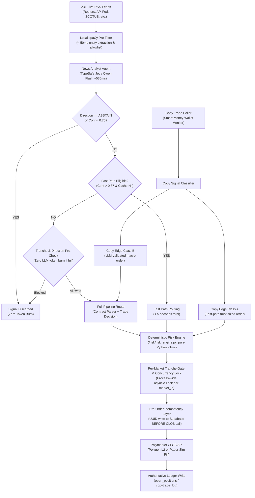

# Polymarket Autonomous Trading Agent

An autonomous, 24/7 AI-driven quantitative trading agent operating on [Polymarket](https://polymarket.com) prediction markets via the Polygon Central Limit Order Book (CLOB).

The agent monitors real-time global news feeds, discovers mispriced prediction market contracts, parses legal resolution criteria with LLMs, applies deterministic mathematical risk controls, and executes trades with sub-second idempotency safeguards.

---

## System Architecture



---

## Key Features & Invariants

### 1. Pure Python Deterministic Risk Engine (`/risk/risk_engine.py`)
- **Zero LLM Imports**: Strictly imports `math`, `decimal`, `datetime`. Deterministic, sub-millisecond execution.
- **Epistemic Humility**: Model confidence is clamped to a hard ceiling of `0.88`. Confidence above `0.88` is never permitted.
- **Kelly Sizing**: Fractional Kelly sizing scaled per strategy ($0.10$ to $0.35$).
- **Portfolio Caps**: Hard single-trade cap ($5\%$), category exposure cap ($30\%$), and correlated exposure cap ($20\%$).
- **Liquidity Safeguards**: Minimum market liquidity entry threshold ($\$5,000$) and automatic emergency market-exit floor ($\$3,000$).
- **Drawdown Circuit Breakers**: Halts trading at $8\%$ daily drawdown, $15\%$ weekly drawdown, and initiates full shutdown at $25\%$ monthly drawdown.

### 2. Per-Market Tranche Gate (Dedupe & Anti-Concentration)
Prevents repeat headline bursts from concentrating portfolio risk on single contracts:
- **Maximum 2 Tranches**: At most 2 positions may ever exist on a single market (`MAX_MARKET_TRANCHES = 2`). A third entry is unconditionally blocked.
- **High-Conviction Repeat Requirement**: Second entries are only allowed if `confidence >= 0.87` (`REPEAT_MIN_CONFIDENCE`).
- **Repeat Sizing Cap**: Second entries are strictly capped at $3\%$ of total portfolio value (`REPEAT_ENTRY_PCT = 0.03`).
- **Repeat Ticket Floor**: Minimum $\$25$ USDC for repeat adds (`MIN_ADD_TICKET_USDC = 25.0`) to avoid dusting, while first entries remain free from repeat floor restrictions (e.g. $\$10$ Class A copy trades permitted).
- **Absolute Market Ceiling**: Cumulative exposure to a single market is capped at $8\%$ (`MAX_MARKET_TRADE_PCT = 0.08`).
- **Opposite-Direction Locking**: Simultaneous YES and NO positions on the same market are strictly blocked (`opposite_direction_open`).
- **Process-Wide Mutex**: Process-wide `asyncio.Lock` keyed strictly on `market_id` alone, held continuously across state load $\to$ risk check $\to$ idempotency write $\to$ order placement $\to$ `open_positions` insertion.
- **Universal Enforcement**: Active across all four execution paths: Fast Path, Full Pipeline, Copy Edge Class A, and Copy Edge Class B.

### 3. Strict Pre-Order Idempotency
- Unique UUID generated at decision time.
- UUID written to Supabase `idempotency_log` table with status `pending` **before** sending the order payload to the Polymarket CLOB.
- Prevents duplicate orders during network hiccups, Polygon RPC latency, or container restarts. Fails closed if Supabase is unavailable.

### 4. Five Complementary Trading Strategies
1. **Velocity / News Catalyst**: Exploits the 90–480 second delay for breaking news to price into Polymarket contracts.
2. **Probability Recalibration (Statistical Arbitrage)**: Exploits retail favorite-longshot biases by comparing market-implied probabilities to empirical base rates.
3. **Cross-Market Correlation Arbitrage**: Enforces Bayesian consistency across interrelated prediction contracts.
4. **Resolution Criteria Exploitation**: Analyzes legal edge cases in contract resolution criteria using DeepSeek V3 / Qwen.
5. **Copy Edge (Smart Money Tracking)**:
   - **Class A (Speed/Alpha)**: Trust-driven sizing up to $\$10$, limit orders priced $0.5$ cents above smart money entry, execution in $<500$ms.
   - **Class B (Macro/Deep Value)**: Routes smart-money signals through LLM validation pipeline, hard-capped at $\$50$ USDC.

---

## Active AI Model Pipeline & Budget

Hard budget target: **$\le \$0.75$ USD/month** on TokenRouter / OpenRouter ($1.00 deposit). Daily burn rate is optimized to **$\sim \$0.012$ – $\$0.015$/day** ($\sim \$0.40$/month).

| Agent Component | Active Model | Provider | Typical Latency | Cost per Call | Behavior / Safeguards |
| :--- | :--- | :--- | :--- | :--- | :--- |
| **News Analyst** | `typesafe/jev-1.13` | TokenRouter | $\sim 535$ms | $\sim \$0.000025$ | Fallback: `qwen/qwen3.5-flash` (`enable_thinking=False`, max 200 tokens). Drops `ABSTAIN` early. |
| **Contract Parser** | `qwen/qwen3.8-flash` | TokenRouter | $\sim 1.2$s | $\sim \$0.000030$ | Fallback: `deepseek-chat`. 18s timeout wrapper. Cached in Supabase for 24h. |
| **Trade Decision** | `deepseek/deepseek-v4.1-flash` | TokenRouter | $\sim 1.8$s | $\sim \$0.000017$ | Hidden thinking disabled; uses Structured 3-Step Reasoning in JSON (`max_tokens=300`). Fallback: `qwen/qwen3.5-flash`. |
| **Coordinator** | Python Aggregation | Local | $< 0.1$ms | $\$0.00$ | Weighted average when agents agree. Escalates to LLM only on high-confidence conflicts ($>0.70$). |
| **Risk Manager** | Pure Python | Local | $< 0.1$ms | $\$0.00$ | Zero LLM calls. Deterministic mathematical execution. |

---

## Repository Structure

```text
├── config.py                 # Central system configuration & risk thresholds
├── main.py                   # Master async entrypoint & worker lifecycle supervisor
├── coordinator/
│   ├── pipeline.py           # Dual-path execution pipeline & stage drop counters
│   └── market_state.py       # Per-market state loader & process-wide lock registry
├── risk/
│   └── risk_engine.py        # Pure Python deterministic risk manager (Rule 1)
├── llm/
│   ├── news_analyst.py       # TypeSafe Jev & Qwen Flash news classification
│   ├── contract_parser.py    # Resolution criteria parser & 24h caching
│   ├── trade_decision.py     # DeepSeek v4.1 Flash structured trade evaluator
│   └── coordinator.py        # Python weighted aggregator & conflict escalation
├── copytrade/
│   ├── executor.py           # Class A & Class B copy trade execution
│   ├── performance_tracker.py# Bayesian wallet trust scoring (0.0 to 1.0)
│   ├── classifier.py         # Wallet tier & priority classifier
│   └── poller.py             # Polygon on-chain smart-money transaction watcher
├── data/
│   ├── rss_poller.py         # 23 live high-signal RSS news feeds
│   ├── spacy_filter.py       # Local NLP pre-filter & entity extractor
│   └── market_discovery.py   # Gamma API contract discovery & keyword indexing
├── execution/
│   ├── polymarket_auth.py    # Polygon L2 CLOB authentication & client setup
│   └── reconciliation.py     # Startup reconciliation between CLOB & Supabase
├── memory/
│   ├── supabase_client.py    # Synchronous client wrapper with 2s timeout fallbacks
│   └── memory_manager.py     # Episodic memory & decay layer (agent_memory)
├── monitoring/
│   └── telegram_alerts.py    # Real-time Telegram alerting & circuit breaker notices
├── tests/
│   ├── test_risk.py          # Unit tests for pure Python risk engine (85 tests)
│   ├── test_dedupe_gate.py   # Integration tests for per-market tranche gate (14 tests)
│   ├── test_integration.py   # End-to-end integration tests for pipeline (15 tests)
│   ├── test_copytrade*.py    # Copy trade trust & execution suites (75 tests)
│   └── test_*.py             # Full test suite (224 tests total, 100% green)
├── PLAN.md                   # Complete system architecture specification
├── PROGRESS.md               # Phase & layer milestone progress tracker
├── TESTING.md                # Pass/fail acceptance criteria per layer
├── MEMORY.md                 # Post-mortem analysis & mistake prevention log
└── deferred-items.md         # Live-capital deployment blockers & deferred designs
```

---

## Getting Started

### Prerequisites
- Python 3.11+
- Supabase account with the 8 standard project tables provisioned
- Polymarket API credentials (L1 wallet key & L2 CLOB API credentials)
- TokenRouter or OpenRouter API key

### 1. Installation
```bash
git clone https://github.com/anshu018/Polymarket.git
cd Polymarket
python -m venv .venv
# On Windows:
.venv\Scripts\activate
# On Linux/macOS:
source .venv/bin/activate

pip install -r requirements.txt
```

### 2. Configuration
Copy the example environment file and populate your keys:
```bash
cp .env.example .env
```
Key environment variables:
- `SUPABASE_URL` and `SUPABASE_KEY`: Supabase database credentials.
- `TOKENROUTER_API_KEY` or `OPENROUTER_API_KEY`: LLM inference endpoints.
- `POLYMARKET_PRIVATE_KEY`: Polygon wallet private key for CLOB signing.
- `TELEGRAM_BOT_TOKEN` and `TELEGRAM_CHAT_ID`: Notification channel.
- `PAPER_TRADING`: Set to `true` for paper simulation (default), `false` for live capital.

### 3. Running the Test Suite
The repository includes a comprehensive 224-test test suite:
```bash
pytest tests/ -v
```
To run specific subsystems:
```bash
# Test the deterministic risk engine
pytest tests/test_risk.py -v

# Test the per-market tranche gate & deduplication
pytest tests/test_dedupe_gate.py -v

# Test the copy trading trust scoring and execution
pytest tests/test_copytrade_trust.py -v
```

### 4. Running the Bot
```bash
python main.py
```
On startup, the bot executes mandatory reconciliation:
1. Queries actual open positions and USDC collateral via Polymarket API.
2. Diffs against Supabase state to confirm consistency.
3. Pre-warms the resolution keyword cache for top volume markets.
4. Starts concurrent RSS news poller workers, copy-trade pollers, and the pipeline supervisor.
